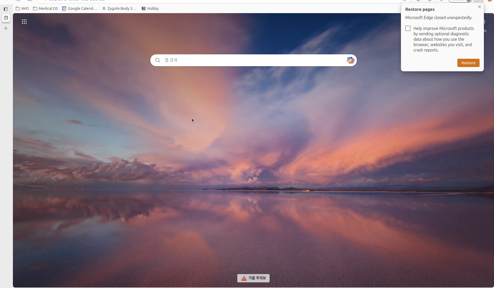

# WindowSwitcher

A lightweight, Tkinter-based window switcher for Linux systems using `wmctrl`. This application provides a searchable GUI to quickly switch between open windows, enhancing productivity with keyboard-driven navigation.



## Features
- **Searchable Window List**: Type in the search bar to filter open windows by ID, class, or title.
- **Keyboard Navigation**: Use arrow keys to navigate the list circularly, with Enter to switch to the selected window and Esc to exit.
- **Minimalist Design**: Built with Python’s standard `tkinter` library, requiring no external GUI frameworks.
 
## Dependencies

### System Requirements
- **Operating System**: Linux with an X11 window manager (e.g., Xorg). Note: Wayland is not natively supported without XWayland compatibility.
- **Python**: Version 3.6 or higher.
- **wmctrl**: A command-line utility for managing X windows. Install it via your package manager:
  - **Ubuntu/Debian**: `sudo apt-get install wmctrl`
  - **Fedora**: `sudo dnf install wmctrl`
  - **Arch Linux**: `sudo pacman -S wmctrl`

### Python Dependencies
- **tkinter**: Must be available in your Python environment (typically included with Python but requires Tcl/Tk on the system; install `python3-tk` if not present).
- **subprocess**: Included in Python’s standard library.

## Installation

1. **Clone the Repository**:
   ```bash
   git clone https://github.com/yourusername/WindowSwitcher.git
   cd WindowSwitcher
   ```

2. **(Optional) Move to a System Path**:
   For convenience, you can move the script to a directory in your system’s PATH (e.g., `/usr/local/bin`):
   ```bash
   sudo mv window_switcher.py /usr/local/bin/window_switcher
   ```
   This allows you to run `window_switcher` from anywhere without specifying the full path.

3. **Register the Script to a System Hotkey (Ubuntu)**:
   To launch WindowSwitcher with a keyboard shortcut (e.g., `Ctrl+Alt+W`), follow these steps:
   - Open the **Settings** application.
   - Navigate to **Keyboard** or **Keyboard Shortcuts** (depending on your Ubuntu version).
   - Scroll to the bottom and click the **"+"** button to add a custom shortcut.
   - Fill in the details:
     - **Name**: `Window Switcher`
     - **Command**: Provide the full path to the script (e.g., `/usr/local/bin/window_switcher` or `/path/to/WindowSwitcher/window_switcher.py`) or just `window_switcher` if it’s in your PATH.
     - **Shortcut**: Press your desired key combination (e.g., `Ctrl+Alt+W`).
   - Click **Add** or **Apply**.
   - Test the shortcut to ensure it launches the WindowSwitcher GUI.

## Usage
- Press the assigned hotkey (e.g., `Ctrl+Alt+W`) to launch the WindowSwitcher.
- Type in the search bar to filter the list of open windows.
- Use the arrow keys to navigate the list, press `Enter` to switch to the selected window, or press `Esc` to close the application.

## Troubleshooting
- **"wmctrl not found"**: Ensure `wmctrl` is installed (`wmctrl -l` should list open windows).
- **Hotkey not working**: Verify the script path in the shortcut settings and ensure it’s executable.
- **Tkinter not found**: Install `python3-tk` (`sudo apt-get install python3-tk` on Ubuntu).
